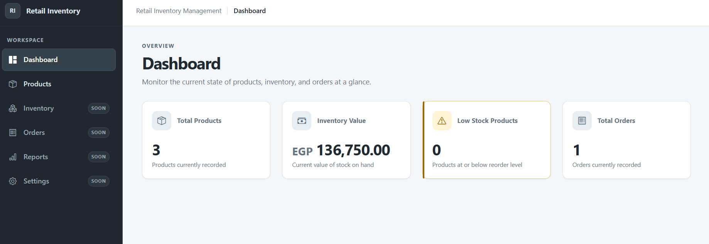
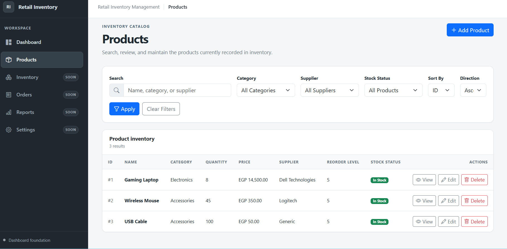

# 🛒 Retail Inventory Management System

A Flask-based retail inventory management system built with PostgreSQL, SQLAlchemy, HTML, CSS, and JavaScript.

The project is being developed in structured groups. Group 1 and Group 2 are now complete and include the dashboard and full product management workflow.

---

## ✅ Current Progress

- ✅ Group 1 — Dashboard
- ✅ Group 2 — Product Management
- ⏳ Group 3 — Order Management
- ⬜ Group 4 — Authentication and User Management
- ⬜ Group 5 — Reports and Analytics
- ⬜ Group 6 — Deployment and Final UI/UX Improvements

---

## 🚀 Implemented Features

### Dashboard

- Total products KPI
- Inventory value KPI
- Low-stock KPI
- Total orders KPI
- Responsive sidebar navigation
- Flash-message support

### Product Management

- View all products
- Add a new product
- View product details
- Edit product information
- Delete products using POST requests
- Protect products referenced by orders from deletion
- Search by product information
- Filter by category
- Filter by supplier
- Filter by stock status
- Safe sorting using an allowlist
- Shared validation for Add and Edit forms
- Stock-status badges:
  - In Stock
  - Low Stock
  - Out of Stock
- Database rollback handling when an operation fails
- Reusable form and delete-modal templates

---

## 🛠️ Technologies Used

- Python
- Flask
- Flask-SQLAlchemy
- SQLAlchemy
- PostgreSQL
- pgAdmin 4
- Jinja2
- HTML5
- CSS3
- JavaScript
- Git and GitHub

---

## 📂 Project Structure

```text
├── app.py
├── config.py
├── models.py
├── requirements.txt
├── test_db.py
├── static/
│   ├── css/
│   │   └── style.css
│   └── js/
│       └── main.js
├── templates/
│   ├── base.html
│   ├── dashboard.html
│   ├── home.html
│   └── products/
│       ├── _delete_modal.html
│       ├── _form.html
│       ├── add.html
│       ├── details.html
│       ├── edit.html
│       └── list.html
└── screenshots/
```

---

## 🔗 Main Routes

```text
GET         /
GET         /dashboard
GET         /products
GET, POST   /products/add
GET         /products/<id>
GET, POST   /products/<id>/edit
POST        /products/<id>/delete
```

---

## 📦 Stock Status Rules

```text
quantity == 0
→ Out of Stock

0 < quantity <= reorder_level
→ Low Stock

quantity > reorder_level
→ In Stock
```

---

## 📸 Screenshots

### Dashboard



### Products List



### Add Product


### Product Details


---

## 🧭 Next Step — Group 3

Group 3 will focus on Order Management:

- Orders list
- Create an order
- Add multiple products to an order
- Calculate totals automatically
- Validate requested quantities
- Reduce product stock after completing an order
- View order details
- Manage order status
- Preserve order history

---

## 👨‍💻 Author

Kareem Abdelrhman
