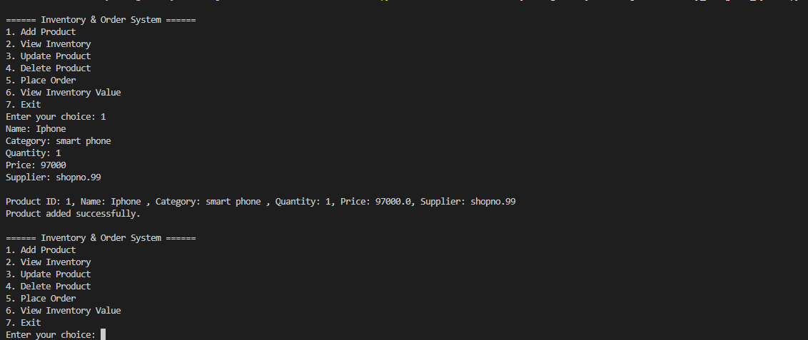
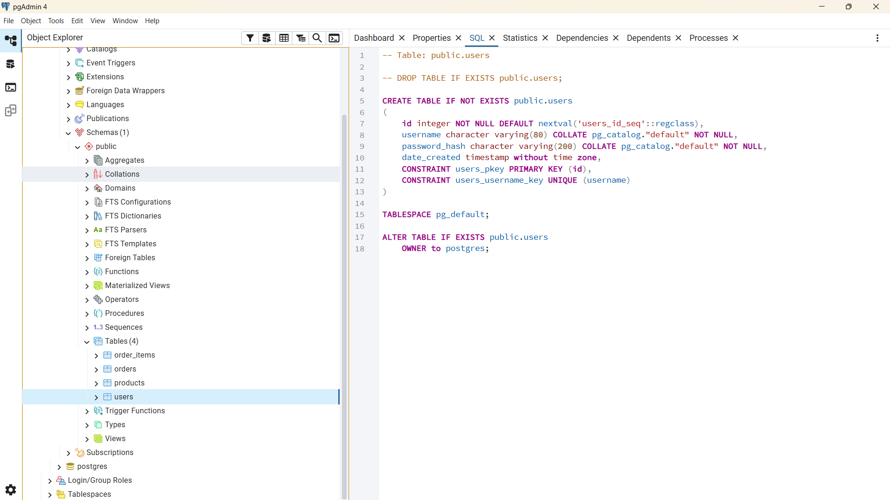
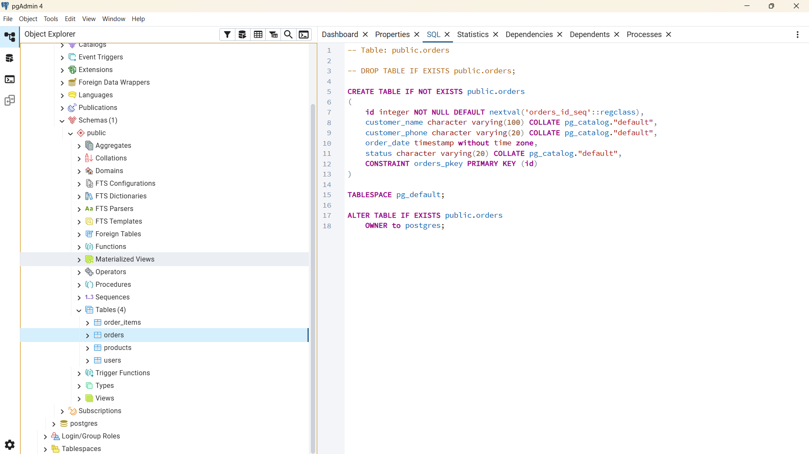
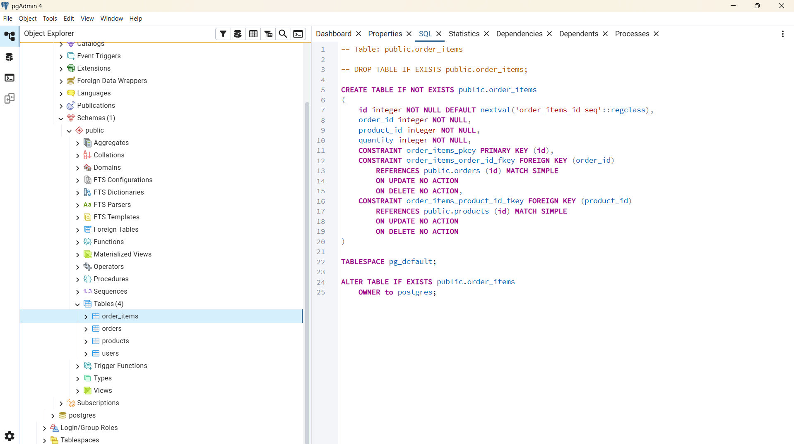

# 🛒 Retail Inventory Management System

A Python-based retail inventory management system connected with PostgreSQL and pgAdmin4.

This project focuses on building a structured backend inventory system using Python OOP concepts and database integration.

---

# 🚀 Features

- Product Management
- User Management
- Order Management
- Order Items Tracking
- PostgreSQL Database Integration
- Structured OOP Design
- Config-based Database Connection
- Modular Python Architecture

---

# 🛠️ Technologies Used

- Python
- PostgreSQL
- pgAdmin4
- SQLAlchemy
- OOP Programming

---

# 📂 Project Structure

```bash
├── config.py
├── models.py
├── Inventory_Managment_system.py
├── test_db.py
├── requirements.txt
├── screenshots/
```

---

# 🧠 System Architecture

The project is separated into multiple modules:

- `config.py`
  Handles database connection configuration.

- `models.py`
  Contains database models:
  - User
  - Product
  - Order
  - OrderItem

- `Inventory_Managment_system.py`
  Main inventory system logic.

- `test_db.py`
  Database connection testing.

---

# 📸 Screenshots

## Terminal Output



## Users Table



## Orders Table



## Order Items



---

# 📌 Current Status

✅ Phase 1 Completed:
- Database integration
- Inventory structure
- Core backend logic

🚧 Phase 2 (Planned):
- Multi-user support
- Shared inventory access
- Authentication system
- API integration

---

# 👨‍💻 Author

Kareem Abdelrhman
